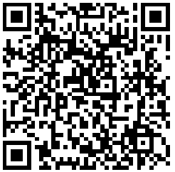

A confidentiality-first electronic voting system.

## About

Agora is a voting platform based on the [Ethereum](https://ethereum.org/en/) public blockchain and a [Zero-Knowledge Proof](https://zkp.science/) cryptographic protocol.

Consult the technical documentation in the [wiki](https://github.com/nova-collective/agora/wiki) of the project: 

* [Agora functional analysis](https://github.com/g3k0/agora/wiki/2.-Functional-analysis)
* [Agora technical analysis](https://github.com/g3k0/agora/wiki/3.-Technical-analysis)

Agora is a web3 dApp based on the [Hardhat framework](https://hardhat.org/) and the [Alchemy SDK](https://www.alchemy.com/). Consult the documentation.

## Prerequisites

In order to run the application you need the following software installed on you machine:

* [Node.js](https://nodejs.org/en) v20.11.1 or above

You also need an Alchemy account.

## Setup

To setup the application follow these steps:

1. clone this repository
2. from the root folder of the application run: `npm i`
3. run `npm run prepare`
4. Write a `.env` file in the root of the project and configure:
    * `SEPOLIA_URL` You can find the data in your Alchemy account, after you create an app there;
    * `ALCHEMY_API_KEY` You can find the data in your Alchemy account;
    * `REPORT_GAS` enable or disable the gas report on smart contracts unit tests executions;
    * `NODE_ENV` set `development` for your local machine;

## How to commit

1. `git add <files list>`
2. `npm run commit`

Remember to follow this convention for commit messages: `AG-<jira id> <description>`, this allows to link the commit to its ticket in the Jira board.

## Test

1. Run the unit tests for smart contracts: `npm run test-contracts`
2. Run the unit test code coverage for smart contracts: `npm run coverage-contracts`
3. Run the unit test for scripts: `npm run test-scripts`

Smart contracts code coverage documentation [here](https://www.npmjs.com/package/solidity-coverage).

CI/CD workflow fails if the unit test code coverage threshold (**80% of lines of code**) for scripts is not met. 

## Run the localhost development network

Hardhat framework provides a local blockchain network that lives in memory, that is useful to test local developments.
To start the network run the command:

`npm run node:start`

## Compile the smart contracts

Run the command: `npm run compile`

## Deploy the smart contract

The smart contracts deploy process is managed, under the hood, by [Ignition](https://hardhat.org/ignition/docs/getting-started#overview).

To deploy smart contract instances run the command:

`npm run deploy-contract <ignition-module-path> <network>`

Ignition will deploy the instances of the smart contract following the logic specified in the ignition module.

To deploy to a specific network (e.g. mainnet, sepora), the network must be configured in the `hardhat.config.ts` file.

For the local network the parameter to pass is `localhost`, there is no need to configure the local network.

# Donations
Support this project and offer me a crypto-coffee!!

"Crypto? No way..."

No problem, there is the related [crowdfunding campaign](https://www.gofundme.com/f/agora-sistema-di-voto-basato-su-blockchain) (in italian):

